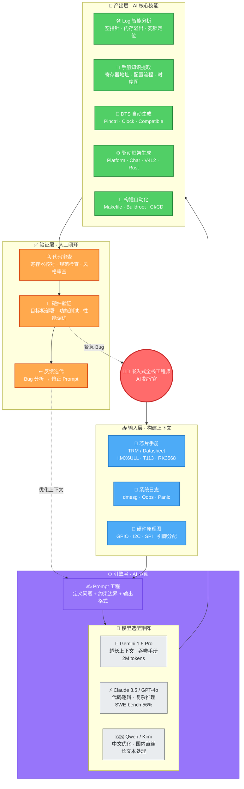
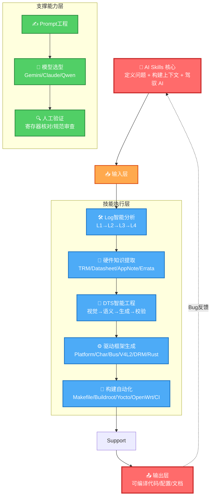
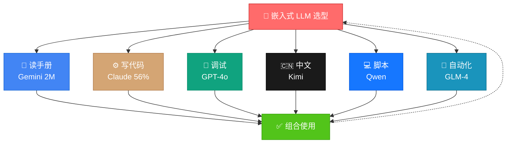
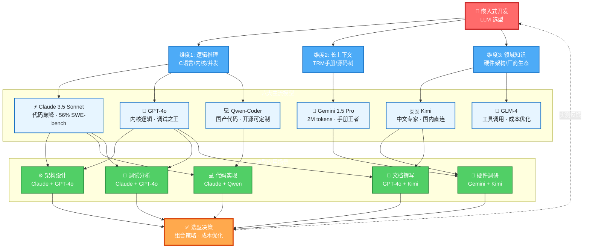
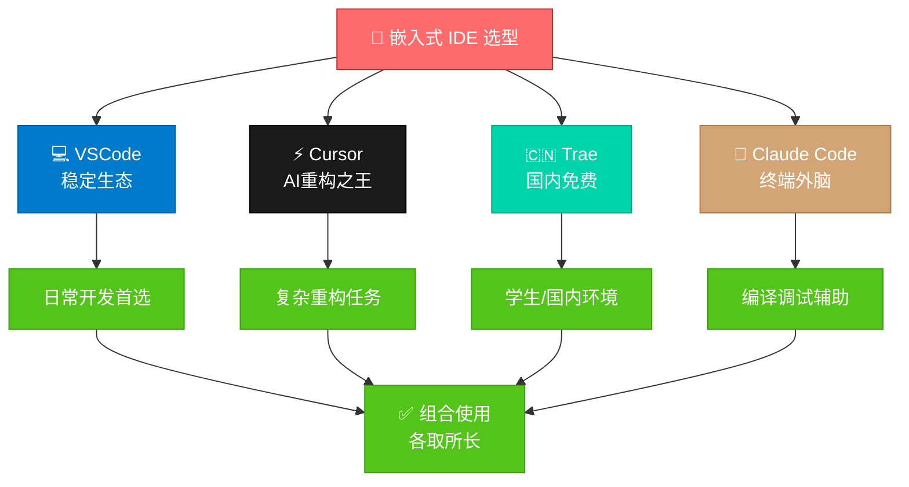

# 嵌入式 AI 协作开发指南


## 模块一：什么是嵌入式开发中的 AI "Skills"（技能）？

在 AI 时代，“技能”不再仅仅是指手写几行 C 代码，而是**“定义问题 + 构建上下文 + 驾驭 AI 生成目标代码/文档”**的能力。嵌入式环境下的 AI Skills 主要包括：

- **Log 分析与排错 (Debugging Skill)：** 能够将晦涩的 `dmesg`、Kernel Oops 堆栈日志投喂给 AI，并引导其定位是空指针、内存溢出还是设备树配置错误。
- **Datasheet/TRM 提取 (Hardware Context Skill)：** 嵌入式工程师最头疼的是看几千页的芯片手册。利用长文本大模型，快速提取特定外设（如 I2C/SPI）的寄存器基地址和配置流程。
- **Device Tree (DTS) 编写与校验：** 给 AI 提供原理图引脚分配关系，让 AI 生成符合 Linux 主线规范的设备树节点，并利用 AI 检查引脚复用（Pinctrl）冲突。
- **驱动框架生成 (Scaffolding Skill)：** 一句话生成标准的 Platform 驱动框架、字符设备驱动模板，甚至是用 Rust 编写的 Linux 内核模块（这也是目前主线趋势）。
- **自动化脚本与 CI/CD 构建：** 让 AI 帮你写复杂的 Makefile、CMakeLists、Yocto/Buildroot 的 recipes，或者 Ubuntu 24 下的交叉编译环境配置脚本。





现在的嵌入式开发，**“懂得利用 AI 解决信息差和繁琐造轮子工作”** 已经成了拉开薪资差距的核心能力。将传统硬核的 i.MX6ULL/T113/RK3568 驱动移植与最新的 AI 生产力工具结合，绝对能切中当下开发者的痛点。

不过，嵌入式开发（C语言、Linux 内核、硬件寄存器）与纯纯的 Web/App 软件开发不同，AI 在这块很容易“胡说八道”（比如捏造不存在的寄存器地址）。因此，课程中关于 AI 的引导必须**极其务实**。

以下我为你梳理的**“AI 驱动嵌入式开发”新增模块大纲及核心干货对比**。

### 1. 范式转移：从"手写代码"到"AI 协作"

#### 传统技能 vs AI 时代技能

| 维度         | 传统嵌入式工程师         | AI 时代嵌入式工程师                  |
| :----------- | :----------------------- | :----------------------------------- |
| **核心能力** | 记忆寄存器地址、手写算法 | 定义问题边界、构建精准上下文         |
| **代码产出** | 亲自编写每一行           | 设计架构，AI 生成，人工审查          |
| **调试方式** | GDB 单步跟踪、打印变量   | AI 分析日志，定位根因，人工验证      |
| **知识获取** | 翻阅数千页 PDF 手册      | 长文本模型提取，人工核对关键数据     |
| **价值定位** | "会写代码的工程师"       | "会驾驭 AI 解决复杂系统问题的指挥官" |

#### AI Skills 定义公式

```plain
AI Skill = 领域专业知识 × Prompt 工程 × 模型选型 × 人工验证
```

### 2. 五大核心 AI Skills 详解

#### Skill 1：Log 智能分析与排错 (Debugging Skill)

**能力定义**：将内核崩溃日志、系统异常转化为可执行的修复方案

**技术层级**：

| 层级        | 能力描述     | 示例场景                         |
| :---------- | :----------- | :------------------------------- |
| **L1 基础** | 识别错误类型 | 区分 `Oops` vs `Panic` vs `WARN` |
| **L2 进阶** | 定位代码位置 | 从堆栈地址找到具体文件/行号      |
| **L3 高级** | 根因分析     | 识别竞态条件、内存泄漏、死锁     |
| **L4 专家** | 修复方案生成 | 输出补丁代码 + 测试用例          |

``` bash
角色：Linux 内核调试专家
任务：分析以下 Kernel Oops 日志，定位问题根因
输入：
- 日志：[粘贴 dmesg]
- 内核版本：6.6.0
- 架构：ARM64 (RK3568)
输出要求：
1. 错误类型识别（空指针/数组越界/栈溢出）
2. 可疑函数定位（文件名:行号）
3. 根因分析（代码逻辑缺陷描述）
4. 修复建议（包含代码补丁）
5. 预防措施（如何避免同类问题）
```

**工具组合**：

- **Claude 3.5 Sonnet**：复杂堆栈分析
- **GPT-4o**：快速解释错误码含义
- **Kimi**：中文社区类似问题检索

#### Skill 2：硬件知识提取 (Hardware Context Skill)

**能力定义**：从海量芯片手册中精准提取寄存器、时序、配置流程

**应用场景矩阵**：

| 文档类型                | 关键信息               | AI 提取策略               |
| :---------------------- | :--------------------- | :------------------------ |
| **TRM (技术参考手册)**  | 寄存器基地址、位域定义 | Gemini 1.5 Pro 全文档索引 |
| **Datasheet**           | 电气特性、时序图       | 多模态识别 + 表格提取     |
| **应用笔记 (App Note)** | 参考设计、典型电路     | 案例归纳 + 对比分析       |
| **勘误表 (Errata)**     | 芯片缺陷、规避方案     | 关键词预警 + 影响评估     |

```bash
Step 1: 文档预处理
  └── 将 PDF 转换为可索引格式（Gemini 直接支持）
  
Step 2: 结构化查询
  └── "提取 Chapter 12.3 UART 控制器的所有寄存器，格式：| 寄存器名 | 偏移地址 | 位域 | 复位值 |"
  
Step 3: 交叉验证
  └── 对比厂商头文件（如 `regs-uart.h`）核对地址
  
Step 4: 知识库化
  └── 转换为 Markdown/YAML，供后续 Prompt 引用
```

**避坑指南**：

> ⚠️ **AI 幻觉高发区**：寄存器物理地址、复位值、保留位定义
>
> ✅ **强制验证策略**：所有提取的地址必须与厂商提供的头文件二次核对

#### Skill 3：Device Tree 智能工程 (DTS Skill)

**能力定义**：从原理图到主线内核认可的设备树节点的全自动转化

**工作流拆解**：

```bash
┌─────────────────────────────────────────────────────────────┐
│  Input: 原理图 PDF / 引脚分配表 / 硬件设计文档              │
├─────────────────────────────────────────────────────────────┤
│  Step 1: 视觉提取 (Vision LLM)                              │
│  └── 识别 GPIO/I2C/SPI/UART 引脚号、复用功能                 │
├─────────────────────────────────────────────────────────────┤
│  Step 2: 语义映射 (Context Building)                         │
│  └── 映射到 SoC 的 pinctrl 定义（如 i.MX6ULL 的 IOMUXC）    │
├─────────────────────────────────────────────────────────────┤
│  Step 3: 节点生成 (Code Generation)                          │
│  └── 生成符合 bindings 规范的节点（compatible/reg/pinctrl）  │
├─────────────────────────────────────────────────────────────┤
│  Step 4: 冲突检测 (Validation)                               │
│  └── AI 检查引脚复用冲突、时钟依赖、中断号重复               │
├─────────────────────────────────────────────────────────────┤
│  Output: 可编译的 .dts / .dtsi 代码段 + 依赖关系说明          │
└─────────────────────────────────────────────────────────────┘
```

**DTS 生成 Prompt 模板**：

```bash
角色：Linux 内核设备树专家，熟悉 ARM/ARM64 架构
任务：为 i.MX6ULL 生成 LED 设备的设备树节点
输入数据：
- 引脚：GPIO1_IO03（主动低电平）
- 功能：系统状态指示灯，心跳模式
- 参考：Documentation/devicetree/bindings/leds/leds-gpio.yaml

输出要求：
1. 完整的节点代码（含注释说明硬件连接）
2. 必要的头文件引用（#include &lt;...&gt;）
3. pinctrl 子节点定义（如果涉及复用）
4. compatible 字符串选择理由
5. 与主线内核的兼容性评估
```

**校验 Checklist**：

- [ ] `compatible` 字符串在主线内核中存在驱动匹配
- [ ] `reg` 地址与 SoC 手册一致
- [ ] `pinctrl-0` 引脚无与其他设备冲突
- [ ] `interrupts` 号在有效范围内
- [ ] 通过 `dtc` 编译无警告

------

#### Skill 4：驱动框架智能生成 (Scaffolding Skill)

**能力定义**：一键生成符合内核规范的驱动骨架、API 实现、用户接口

**生成能力矩阵**：

| 驱动类型          | 生成内容                           | 技术要点                         |
| :---------------- | :--------------------------------- | :------------------------------- |
| **Platform 驱动** | probe/remove、资源管理、设备树匹配 | `devm_*` 资源、OF 表匹配         |
| **字符设备**      | file_operations、ioctl、sysfs      | `miscdevice` 或 `cdev`、并发控制 |
| **I2C/SPI 设备**  | 通信协议层、寄存器读写封装         | 时序控制、错误重试、DMA 支持     |
| **V4L2 摄像头**   | 子设备模型、视频流控制、格式协商   | `media_entity`、`vb2_queue`      |
| **DRM 显示**      | CRTC/Encoder/Connector 链          | atomic_commit、GEM 缓冲区        |
| **Rust 驱动**     | 安全抽象、内核模块宏               | `kernel_module!`、`unsafe` 边界  |

```bash
输入：一句话描述 + 参考驱动路径
  └── "生成 T113 的 PWM 驱动，参考 drivers/pwm/pwm-sun8i.c"

AI 处理：
  1. 分析参考驱动的架构模式
  2. 提取可复用的设计模式（资源管理、错误处理）
  3. 替换平台相关细节（寄存器地址、时钟名）
  4. 生成符合 checkpatch.pl 规范的代码

输出：完整驱动文件 + Makefile/Kconfig 修改 + 测试建议
```

**代码质量约束**：

- 必须通过 `checkpatch.pl --strict` 检查
- 使用内核最新 API（如 `timer_setup` 替代 `init_timer`）
- 包含 `MODULE_DEVICE_TABLE(of, ...)` 支持自动加载

------

#### Skill 5：构建系统自动化 (Build Automation Skill)

**能力定义**：自动化处理从源码到烧录镜像的全流程配置

**覆盖范围**：

| 构建系统          | 自动化内容                                        | 典型输出           |
| :---------------- | :------------------------------------------------ | :----------------- |
| **裸机/Makefile** | 交叉编译配置、链接脚本、启动代码                  | 可烧录的 bin/elf   |
| **Buildroot**     | 外部内核/uboot 配置、rootfs 定制、post-image 脚本 | sdcard.img         |
| **Yocto**         | Layer 创建、bbappend 编写、镜像配方               | wic 镜像           |
| **OpenWrt**       | 软件包 Makefile、内核补丁集成、LUCI 界面          | sysupgrade.bin     |
| **Kernel 编译**   | defconfig 定制、模块编译、Device Tree 编译        | zImage/dtb/modules |
| **CI/CD**         | GitHub Actions/GitLab CI 多平台编译、测试、发布   | 自动化流水线       |

### 3. AI Skills 的层级演进模型

```plain
Level 1: 辅助工具使用者
    └── 用 Copilot 补全代码，用 ChatGPT 查资料
    └── 能力：基础 Prompt 编写，单轮对话
    
Level 2: 上下文构建师
    └── 能构建复杂 Prompt，让 AI 理解硬件背景
    └── 能力：多轮对话管理、Few-shot 示例设计
    
Level 3: 模型选型专家
    └── 为不同任务选择最优模型组合（Gemini+Claude+Kimi）
    └── 能力：成本效益分析、API 集成、本地部署
    
Level 4: 工作流架构师
    └── 设计端到端的 AI 自动化流水线（手册→代码→测试）
    └── 能力：多 Agent 协作、CI/CD 集成、知识库构建
    
Level 5: AI 原生创新者
    └── 创造新的 AI 辅助开发范式，定义行业标准
    └── 能力：模型微调、专用 Skill 开发、社区贡献
```




### 章节总结：如何掌握这些 Skills

**学习路径建议**：

```plain
Week 1-2: 基础认知
  ├── 理解 AI Skills 定义与范式转移
  ├── 熟悉各模型特性（Gemini/Claude/Qwen）
  └── 练习基础 Prompt 编写

Week 3-4: 单点突破
  ├── 选择一项技能深入（建议从 Log 分析入手）
  ├── 收集 10+ 个实战案例，建立个人 Prompt 库
  └── 形成"输入→AI处理→输出→验证"的肌肉记忆

Week 5-6: 组合应用
  ├── 设计端到端工作流（如：手册→DTS→驱动→测试）
  ├── 尝试多模型协同（Gemini 读手册 + Claude 写代码）
  └── 建立个人知识库（.ai-prompts/ 目录）

Week 7+: 持续优化
  ├── 跟踪内核社区最新规范，更新 Prompt 模板
  ├── 参与开源项目，贡献 AI 辅助的驱动代码
  └── 向 Level 4-5 进阶，创造自己的方法论
```

**关键成功因素**：

1. **人工验证永不跳过**：AI 生成的寄存器地址必须核对
2. **Prompt 资产化积累**：建立个人/团队的 `.ai-prompts/` 仓库
3. **模型组合思维**：没有万能模型，只有最优组合
4. **反馈闭环**：每次 Bug 都是优化 Prompt 的机会

## 模块二：百模大战——哪个 LLM 更适合嵌入式开发？

嵌入式涉及到底层 C 语言、晦涩的硬件架构和长文本手册，对大模型的**逻辑推理**和**长上下文窗口**要求极高。



| 大模型 (LLM)                  | 核心优势                                                     | 在嵌入式开发中的最佳适用场景                                 | 局限性/需要注意的点                                          |
| :---------------------------- | :----------------------------------------------------------- | :----------------------------------------------------------- | :----------------------------------------------------------- |
| **ChatGPT (GPT-4o)**          | 极强的复杂 C/C++ 逻辑推理能力，对 Linux 内核源码的熟悉度极高。 | 核心算法实现、复杂驱动架构设计、深度解析 Kernel Oops 堆栈。  | 无法直接一次性吞下超大容量的芯片参考手册（TRM）。            |
| **Gemini (1.5 Pro)**          | **恐怖的 200万 Token 上下文窗口。**                          | **“啃”芯片手册的王者。** 直接扔进去瑞芯微 RK3568 的完整 PDF 手册，提问特定寄存器配置，准确率极高。 | 中文表达有时不够地道，偶尔在非常基础的代码逻辑上绕弯子。     |
| **Claude 3.5 Sonnet**         | 目前公认的**最强代码生成模型**，思维连贯性极强。             | 重构老旧驱动代码、分析复杂的中断处理逻辑、编写高质量的 Shell 脚本。 | 需要科学网络环境，国内 API 访问门槛较高。                    |
| **Kimi (月之暗面)**           | 中文长文本处理极其优秀，国内网络直连。                       | 阅读国内原厂（全志 T113、瑞芯微）的中文技术文档、原理图文字说明，进行快速总结。 | 核心代码逻辑生成能力弱于 GPT-4o 和 Claude。                  |
| **Qwen (通义千问 Coder/Max)** | 懂中文，且代码能力（尤其是 Qwen2.5-Coder）在开源界屠榜，甚至持平 GPT-4。 | 日常代码补全、国内网环境下的主力 AI 助手、Linux 系统级 API 调用排错。 | 对极冷门的硬件架构（如某些老旧的 MIPS 平台）认知不如海外大厂模型。 |
| **GLM-4 (智谱)**              | API 价格便宜，工具调用（Function Calling）能力强。           | 适合集成到自己写的本地 Python 脚本中，用于自动化处理编译产生的警告日志。 | 纯 C 语言和内核驱动的底层深度理解稍逊一筹。                  |

### 2.1 嵌入式场景对 LLM 的特殊要求

#### 三大核心能力维度

```plain
┌─────────────────────────────────────────────────────────────┐
│  维度1：逻辑推理能力 (Logical Reasoning)                      │
│  ├── C 语言指针操作、内存管理、位运算                          │
│  ├── Linux 内核并发控制（Spinlock/Mutex/RCU）                 │
│  └── 硬件时序逻辑、中断处理、DMA 传输                          │
├─────────────────────────────────────────────────────────────┤
│  维度2：长上下文窗口 (Long Context Window)                    │
│  ├── 芯片手册 (TRM)：500-3000 页 PDF                         │
│  ├── 内核源码树：drivers/ 目录数万文件                        │
│  └── 调试日志：Kernel Panic + 多线程堆栈                      │
├─────────────────────────────────────────────────────────────┤
│  维度3：领域知识深度 (Domain Expertise)                       │
│  ├── 硬件架构：ARM/ARM64/RISC-V/MIPS                         │
│  ├── 内核 API 演进：从 4.x 到 6.x 的兼容性变化               │
│  └── 厂商生态：Rockchip/Allwinner/NXP/i.MX 特有问题          │
└─────────────────────────────────────────────────────────────┘
```

#### 选型决策矩阵

| 开发阶段     | 首要能力 | 次要能力 | 模型优先级                   |
| :----------- | :------- | :------- | :--------------------------- |
| **硬件调研** | 长上下文 | 领域知识 | Gemini > Kimi > GPT-4o       |
| **架构设计** | 逻辑推理 | 领域知识 | Claude > GPT-4o > Qwen       |
| **代码实现** | 逻辑推理 | 代码规范 | Claude > GPT-4o > Qwen-Coder |
| **调试分析** | 逻辑推理 | 长上下文 | Claude > GPT-4o > Gemini     |
| **文档撰写** | 领域知识 | 长上下文 | GPT-4o > Kimi > Qwen         |

### 2.2 六大主流模型深度解析

#### 2.2.1 ChatGPT (GPT-4o) —— 内核逻辑之王

**技术规格**

- 上下文窗口：128K tokens（约 300 页文档）
- 知识截止：2024 年初
- API 可用性：全球

**嵌入式核心优势**

| 能力项           | 表现评级 | 典型场景                            |
| :--------------- | :------- | :---------------------------------- |
| C 语言复杂逻辑   | ★⭐⭐⭐⭐    | 指针链表操作、位域结构体            |
| Linux 内核熟悉度 | 5星    | 识别内核 API 版本差异、推荐替代方案 |
| 并发与同步       | 5/5    | 分析竞态条件、设计锁策略            |
| 调试分析         | 5/5    | Kernel Oops 堆栈解析、根因定位      |

**实战案例：Kernel Panic 分析**

```markdown
输入：
[  123.456789] Unable to handle kernel NULL pointer dereference at virtual address 00000000
[  123.456790] pgd = c0004000
[  123.456792] [00000000] *pgd=00000000
[  123.456794] Internal error: Oops: 805 [#1] PREEMPT SMP ARM
...（完整堆栈）

GPT-4o 输出：
1. 错误类型：空指针解引用（NULL pointer dereference）
2. 可疑位置：drivers/leds/leds-gpio.c:127（根据堆栈 #3）
3. 根因分析：probe 函数中未检查 devm_gpiod_get() 返回值，
   当设备树节点缺失 "gpios" 属性时返回 NULL，直接解引用导致崩溃
4. 修复方案：
   struct gpio_desc *desc;
   desc = devm_gpiod_get(dev, NULL, GPIOD_OUT_LOW);
   if (IS_ERR(desc)) {
       dev_err(dev, "Failed to get GPIO\n");
       return PTR_ERR(desc);
   }
5. 预防措施：所有 devm_* 返回值必须检查 IS_ERR()
```

**局限性**

- ❌ 无法一次性处理完整 TRM（需分段上传）
- ❌ 长对话中可能丢失早期上下文（如寄存器基地址）
- ❌ 对最新内核版本（6.8+）的知识可能滞后

**最佳实践**

```plain
使用策略：分段处理 + 关键信息锚定
1. 将 TRM 按章节拆分（如第12章 UART）
2. 在 Prompt 中重复关键上下文："基于之前提到的 RK3568 UART2 基地址 0xFE670000..."
3. 复杂任务拆分为多轮对话，每轮总结关键结论
```

------

#### 2.2.2 Gemini 1.5 Pro —— 长文档吞噬者

**技术规格**

- 上下文窗口：**2M tokens**（约 1.4 万页文档，业界第一）
- 多模态：支持 PDF、图片、音频、视频直接输入
- API 可用性：Google AI Studio（）

**嵌入式核心优势**

| 能力项       | 表现评级 | 典型场景                      |
| :----------- | :------- | :---------------------------- |
| 超长文档处理 | 5/5    | 整本 TRM 上传、跨章节关联查询 |
| 多模态识别   | 5/5    | 原理图截图识别、时序图解析    |
| 信息检索速度 | 5/5    | 秒级回答特定寄存器配置        |
| 跨文档关联   | 4/5    | 对比不同版本手册差异          |

**实战案例：T113 完整 TRM 分析**

```markdown
上传文件：T113_S3_User_Manual_V1.0.pdf（共 2156 页）

Query 1: "DE 模块支持哪些分辨率？列出所有时序参数寄存器"
Gemini 输出：
- 支持分辨率：1920x1080, 1280x720, 1024x600 等（见 3.2.1 节）
- 关键寄存器：
  | 寄存器名 | 偏移地址 | 功能描述 |
  |---------|---------|---------|
  | DE_CTRL | 0x0000 | 模块使能、工作模式 |
  | DE_SIZE | 0x0004 | 输出分辨率配置 |
  | DE_SYNC | 0x0008 | 同步信号时序 |

Query 2: "这些寄存器和时钟章节有什么关联？"
Gemini 输出：
- DE 模块依赖 DE_CLK（见 2.4.3 节 Clock Tree）
- 必须先使能 CCU 的 DE_CLK_GATE（0x0300_1000 + 0x64）位 12
- 否则寄存器写入无效，导致显示异常
```

**局限性**

- ❌ 代码逻辑严谨性不如 Claude（位运算常出错）
- ❌ 中文表达不够地道（技术术语翻译偏差）
- ❌ 对 Linux 内核社区规范理解不深

**最佳实践**

```plain
使用策略：知识提取 + 人工复核 + Claude 代码生成
1. Gemini 负责：从 TRM 提取寄存器定义、时序要求、配置流程
2. 人工核对：关键地址与厂商头文件对比
3. Claude 负责：基于提取的信息生成驱动代码
4. 最终验证：硬件实测确认
```

#### 2.2.3 Claude 3.5 Sonnet —— 代码生成巅峰

**技术规格**

- 上下文窗口：200K tokens
- SWE-bench 准确率：**56%**（业界最高，GPT-4o 仅 33.2%）
- API 可用性：Anthropic API（）

**嵌入式核心优势**

| 能力项         | 表现评级 | 典型场景                    |
| :------------- | :------- | :-------------------------- |
| 代码生成质量   | 5/5    | 复杂驱动框架、多文件重构    |
| 思维连贯性     | 5/5    | 长代码逻辑保持上下文一致    |
| 内核规范合规   | 5/5    | 自动遵循 checkpatch.pl 规则 |
| 调试建议精准度 | 5/5    | 编译错误修复、API 迁移指导  |

**实战案例：驱动重构（厂商内核 → 主线内核）**

```markdown
任务：将 T113 的 PWM 驱动从 Linux 4.9 厂商内核移植到 6.6 主线

输入：
- 原始代码：drivers/pwm/pwm-sun8i-v2.c（厂商版，使用废弃 API）
- 目标参考：drivers/pwm/pwm-sun8i.c（主线已有 sun8i 基础）
- 内核版本：6.6.0

Claude 3.5 输出流程：
1. 差异分析：
   - 厂商版使用 pwmchip_add() + pwm_config()
   - 主线版使用 devm_pwmchip_add() + atomic PWM 接口
   
2. 重构方案：
   - 替换为 atomic_pwm_ops 结构体
   - 使用 devm_platform_iomap() 替代 ioremap()
   - 添加 of_pwm_xlate_with_args() 支持
   
3. 生成代码：
   - 完整 pwm-sun8i-t113.c（符合主线规范）
   - 修改 drivers/pwm/Makefile 和 Kconfig
   - 生成 Device Tree 绑定文档
   
4. 测试建议：
   - 使用 pwm-test 工具验证
   - 检查 /sys/class/pwm/pwmchip0/ 节点
```

**局限性**

- ❌ 需要科学网络环境（国内访问门槛高）
- ❌ 对中文资料理解较弱
- ❌ 无法直接处理 PDF（需先提取文本）

**最佳实践**

```plain
使用策略：Claude 为主力，配合其他模型补齐
1. 架构设计：Claude 生成驱动框架
2. 手册查询：Gemini 提取寄存器信息提供给 Claude
3. 中文资料：Kimi 翻译/总结后输入 Claude
4. 快速验证：GPT-4o 生成测试用例
```

#### 2.2.4 Kimi (月之暗面) —— 中文长文本专家

**技术规格**

- 上下文窗口：200K+ tokens（实测支持超长中文文档）
- 核心优势：中文语义理解、国内网络直连
- 成本：免费额度 generous，付费版性价比高

**嵌入式核心优势**

| 能力项       | 表现评级 | 典型场景                        |
| :----------- | :------- | :------------------------------ |
| 中文技术文档 | 5/5    | 全志/瑞芯微中文手册、博客、论坛 |
| 长文本摘要   | 5/5    | 百页中文规格书快速提炼          |
| 网络可达性   | 5/5    | 国内开发环境零配置使用          |
| 代码解释     | ⭐⭐⭐⭐☆    | 中文注释生成、代码逻辑讲解      |

**实战案例：中文 BSP 代码分析**

```markdown
输入：全志 T113 官方 Linux 4.9 BSP 的 drivers/video/sunxi/ 目录（中文注释）

Kimi 任务：
1. "总结 display 驱动架构，画出模块关系图"
2. "解释 DE、TCON、DSI、LCD 之间的关系"
3. "找出与主线内核 DRM 子系统的主要差异"

输出：
- 架构图：User App → FB/DEV → sunxi_disp → DE → TCON → LCD/DSI
- 关键差异：
  * BSP 使用自定义 sunxi_disp 接口，非标准 DRM
  * 缺乏 atomic commit，不支持异步页面翻转
  * 建议迁移路径：sunxi_disp → drm_simple_kms_helper
```

**局限性**

- ❌ C 语言底层代码生成能力弱于 Claude/GPT-4o
- ❌ 位运算、指针操作等硬核代码常出错
- ❌ 对国际主流内核社区规范了解不足

**最佳实践**

```plain
使用策略：中文入口 + 信息中转
1. Kimi 负责：阅读中文手册、总结中文博客、翻译英文资料为中文笔记
2. 信息提炼：将 Kimi 的中文总结转化为结构化英文输入
3. Claude/GPT-4o 负责：基于提炼信息生成代码
4. 最终输出：Kimi 将技术文档翻译为中文（如需）
```

------

#### 2.2.5 Qwen (通义千问) —— 国产代码之王

**技术规格**

- 模型版本：Qwen2.5-Coder（开源）、Qwen-Max（闭源 API）
- 代码能力：HumanEval 得分 92.1%，持平 GPT-4o
- 生态集成：阿里云、钉钉、国内 IDE 插件

**嵌入式核心优势**

| 能力项         | 表现评级 | 典型场景                        |
| :------------- | :------- | :------------------------------ |
| 中文代码补全   | ⭐⭐⭐⭐⭐    | 国内 IDE 插件实时补全           |
| Linux 系统编程 | ⭐⭐⭐⭐⭐    | 系统调用、POSIX API、Shell 脚本 |
| 阿里云生态     | ⭐⭐⭐⭐⭐    | 与阿里云 IoT 平台、函数计算集成 |
| 开源可定制     | ⭐⭐⭐⭐⭐    | 本地部署、微调专用模型          |

**实战案例：Ubuntu 24.04 交叉编译环境脚本**

```markdown
任务：编写一键配置脚本，支持 i.MX6ULL/T113/RK3568 三平台

Qwen-Coder 输出：
#!/bin/bash
# setup-cross-env.sh - Ubuntu 24.04 LTS
# Supports: i.MX6ULL (armhf), T113 (armhf), RK3568 (arm64)

set -e

TOOLCHAINS=(
    "imx6ull:arm-linux-gnueabihf:https://.../gcc-linaro-7.5.0.tar.xz"
    "t113:arm-linux-gnueabihf:https://.../gcc-arm-9.2.tar.xz"
    "rk3568:aarch64-linux-gnu:https://.../gcc-arm-10.3.tar.xz"
)

install_toolchain() {
    local name=$1 prefix=$2 url=$3
    echo "Installing $name toolchain..."
    wget -q $url -O /tmp/${name}.tar.xz
    sudo tar -xf /tmp/${name}.tar.xz -C /opt/
    echo "export PATH=/opt/${prefix}/bin:\$PATH" >> ~/.bashrc
}

# 交互式选择
select target in "i.MX6ULL" "T113" "RK3568" "All"; do
    case $target in
        "i.MX6ULL") install_toolchain "${TOOLCHAINS[0]}"; break ;;
        "T113") install_toolchain "${TOOLCHAINS[1]}"; break ;;
        "RK3568") install_toolchain "${TOOLCHAINS[2]}"; break ;;
        "All") for tc in "${TOOLCHAINS[@]}"; do install_toolchain $tc; done; break ;;
    esac
done

# 验证
${prefix}-gcc --version
echo "Cross-compile environment ready!"
```

**局限性**

- ❌ 极冷门硬件架构（MIPS、PowerPC）知识不足
- ❌ 最新内核（6.7+）特性跟进稍慢
- ❌ 复杂驱动架构设计弱于 Claude

**最佳实践**

```plain
使用策略：日常主力 + 生态集成
1. 日常开发：VSCode + Qwen 插件实时补全
2. 脚本编写：Shell/Python/Makefile 自动化
3. 阿里云部署：与阿里云 IoT 平台联动
4. 复杂任务：切换 Claude/GPT-4o
```

#### 2.2.6 GLM-4 (智谱) —— 工具调用与成本优化

**技术规格**

- 核心优势：Function Calling、工具调用、API 价格低廉
- 场景定位：自动化脚本集成、本地知识库问答

**嵌入式核心优势**

表格


| 能力项   | 表现评级 | 典型场景                         |
| :------- | :------- | :------------------------------- |
| 工具调用 | ⭐⭐⭐⭐⭐    | 调用编译器、检查脚本、自动化测试 |
| API 成本 | ⭐⭐⭐⭐⭐    | 批量处理日志、大规模代码审查     |
| 本地部署 | ⭐⭐⭐⭐☆    | 私有化知识库、企业内网环境       |
| 快速响应 | ⭐⭐⭐⭐☆    | 实时问答、简单代码生成           |

**实战案例：自动化编译警告处理**

Python

复制

```python
# 使用 GLM-4 的 Function Calling 能力
import subprocess
from zhipuai import ZhipuAI

client = ZhipuAI(api_key="your-api-key")

def build_kernel():
    """执行内核编译，捕获警告"""
    result = subprocess.run(
        ["make", "ARCH=arm64", "CROSS_COMPILE=aarch64-linux-gnu-"],
        capture_output=True, text=True
    )
    return result.stderr  # 编译警告输出

def fix_warning(file_path, line_no, warning_msg):
    """根据警告自动修复代码"""
    with open(file_path, 'r') as f:
        lines = f.readlines()
    
    # 调用 GLM-4 生成修复建议
    response = client.chat.completions.create(
        model="glm-4",
        messages=[{
            "role": "user",
            "content": f"Fix this kernel warning:\nFile: {file_path}\nLine: {line_no}\nWarning: {warning_msg}\nCode context: {lines[line_no-2:line_no+2]}"
        }],
        tools=[{
            "type": "function",
            "function": {
                "name": "apply_fix",
                "description": "Apply code fix to file",
                "parameters": {
                    "file_path": {"type": "string"},
                    "line_no": {"type": "integer"},
                    "new_code": {"type": "string"}
                }
            }
        }]
    )
    return response.choices[0].message.tool_calls[0].function.arguments

# 主流程
warnings = build_kernel()
for w in parse_warnings(warnings):  # 解析警告
    fix = fix_warning(w.file, w.line, w.message)
    apply_fix(fix)  # 自动应用修复
```

**局限性**

- ❌ 纯 C 语言底层理解深度不足
- ❌ 复杂内核子系统（DRM、V4L2）知识薄弱
- ❌ 硬件寄存器级代码生成不可靠

**最佳实践**

plain

复制

```plain
使用策略：自动化集成 + 成本敏感场景
1. CI/CD 流水线：自动分析编译警告、生成修复建议
2. 日志处理：批量分析 dmesg、统计错误模式
3. 知识库问答：基于本地文档的 RAG 系统
4. 复杂代码：不单独使用，作为辅助验证
```

------

### 2.3 模型组合策略：嵌入式开发的"组合拳"

#### 2.3.1 经典工作流组合

```plain
┌─────────────────────────────────────────────────────────────┐
│  阶段1：硬件调研 (Hardware Research)                         │
│  ├── Gemini 1.5 Pro：吞完整本 TRM，提取寄存器/时序信息        │
│  ├── Kimi：查找中文应用笔记、论坛经验                         │
│  └── 输出：结构化硬件规格表（Markdown/YAML）                  │
├─────────────────────────────────────────────────────────────┤
│  阶段2：架构设计 (Architecture Design)                        │
│  ├── Claude 3.5：设计驱动框架、子系统选择                     │
│  ├── GPT-4o：对比主线内核参考实现，评估兼容性                 │
│  └── 输出：驱动架构文档 + 文件清单                            │
├─────────────────────────────────────────────────────────────┤
│  阶段3：代码实现 (Implementation)                             │
│  ├── Claude 3.5：生成核心驱动代码（probe/ops/file_ops）      │
│  ├── Qwen：编写 Makefile、Kconfig、测试脚本                   │
│  └── 输出：可编译的驱动代码 + 构建配置                        │
├─────────────────────────────────────────────────────────────┤
│  阶段4：调试优化 (Debug & Optimize)                          │
│  ├── Claude 3.5：分析 Kernel Panic、定位根因                │
│  ├── GPT-4o：生成测试用例、用户空间工具                       │
│  └── 输出：修复补丁 + 测试报告                                │
├─────────────────────────────────────────────────────────────┤
│  阶段5：文档交付 (Documentation)                              │
│  ├── GPT-4o：撰写技术博客、英文文档                           │
│  ├── Kimi：翻译为中文、整理 FAQ                               │
│  └── 输出：完整技术文档 + 社区分享                            │
└─────────────────────────────────────────────────────────────┘
```

#### 2.3.2 预算敏感型组合

| 预算级别   | 推荐组合                                      | 月成本估算 | 适用场景           |
| :--------- | :-------------------------------------------- | :--------- | :----------------- |
| **免费版** | Kimi + Qwen（免费额度）+ 本地 Ollama          | ¥0         | 学生、个人学习     |
| **经济版** | Kimi + Qwen-Coder + Claude（按需）            | ¥50-100    | 小型项目、初创团队 |
| **标准版** | Claude Pro + Gemini API + Qwen                | ¥300-500   | 专业开发、中型项目 |
| **企业版** | Claude Enterprise + Azure OpenAI + 私有化部署 | ¥2000+     | 大型团队、合规要求 |

#### 2.3.3 网络环境适配组合

```plain
国内网络环境（无代理）：
  主力：Kimi + Qwen + 本地 Ollama
  辅助：Trae IDE 内置 AI（免费 Claude/GPT-4o）
  局限：无法使用 Gemini、Claude API 直接访问

国际网络环境（有代理）：
  主力：Claude 3.5 + Gemini 1.5 Pro + GPT-4o
  辅助：Kimi（中文资料）+ Qwen（脚本编写）
  优势：全模型可用，组合灵活

混合策略（企业推荐）：
  敏感代码：本地 Ollama + CodeLlama
  一般开发：Kimi + Qwen（国内直连）
  复杂任务：Claude（通过合规代理）
```

------

### 2.4 选型决策速查表

| 任务                | 首选           | 备选           | 避免使用             |
| :------------------ | :------------- | :------------- | :------------------- |
| 阅读 2000 页 TRM    | Gemini 1.5 Pro | Kimi（分多次） | GPT-4o（上下文不足） |
| 生成 Platform 驱动  | Claude 3.5     | GPT-4o         | GLM-4（底层理解弱）  |
| 分析 Kernel Panic   | Claude 3.5     | GPT-4o         | Kimi（逻辑推理弱）   |
| 编写 Shell/Makefile | Qwen-Coder     | GPT-4o         | Gemini（代码逻辑绕） |
| 中文手册总结        | Kimi           | Qwen           | Claude（中文弱）     |
| 批量处理编译日志    | GLM-4          | Qwen           | Claude（成本高）     |
| 多文件重构          | Claude 3.5     | Cursor（IDE）  | 单模型对话           |
| 硬件时序分析        | Gemini + 人工  | GPT-4o         | 纯文本模型           |

### 2.5 思维导图：嵌入式 LLM 选型全景




## 模块三：IDE 与 AI 工具的演进——开发时刻如何选择？

对于嵌入式开发，由于代码通常运行在远程 Linux 机器（如你的 Ubuntu 24 环境），**对 Remote-SSH 的支持程度**是评判这些工具的生死线。

1. **VSCode + 插件 (Copilot / Cline / Codeium)**
   - **定位：** 嵌入式开发者的“舒适区”和行业标准。
   - **优势：** Remote-SSH 功能天下无敌。结合 Cline 等插件，可以直接在 IDE 里调用各种大模型 API；或者使用免费的 Codeium 进行行级代码补全。
   - **适用场景：** 需要在 Ubuntu 服务器或开发板上直接改代码、编译、调试的全栈场景。
2. **Cursor (目前最火的 AI IDE)**
   - **定位：** 基于 VSCode 深度二次开发的 AI 专属 IDE。
   - **优势：** Composer 功能可以将多个文件联动修改。比如你改了设备树里的一个节点名字，它可以自动帮你把 C 驱动里的匹配字符串也改掉。
   - **劣势：** Remote 插件有时容易断连，且高级功能收费较贵。
3. **Trae (字节跳动新推 IDE)**
   - **定位：** 国内版“免费 Cursor”，同样基于 VSCode 架构。
   - **优势：** 界面极其清爽，国内网络直连，默认搭载 Claude 3.5 Sonnet 和 GPT-4o（目前免费期）。
   - **适用场景：** 学生党、受限于国内网络环境的开发者。由于底层和 VSCode 一样，Remote-SSH 体验不错。
4. **Claude Code / GitHub Copilot CLI (命令行 Agent)**
   - **定位：** 终端里的 AI 助手。
   - **适用场景：** 嵌入式开发大量时间在终端里敲 `make`、`git` 和排查 `gcc` 报错。当 Ubuntu 24 编译报错时，直接在终端让 Claude Code 读取报错日志并自动修改 Makefile。

### 3.1 嵌入式开发环境的特殊挑战

#### 为什么 Remote-SSH 是生死线？

```plain
传统 Web/App 开发                    嵌入式 Linux 开发
--------------------------------------------------
本地编码 → 本地运行 → 本地调试        本地编码 → 交叉编译 → 远程目标板运行
     ↑                                    ↑
   单机闭环                          必须连接远程 Linux 环境
                                    (Ubuntu 24.04 服务器/开发板)

关键差异：
- 编译工具链运行在 x86 Linux，而非 Windows/Mac
- 目标代码运行在 ARM 架构，非本地执行
- 调试需要串口/JTAG 连接，物理上分离
- 内核源码树巨大（数 GB），无法本地同步
```

#### 工具选型的四维评估模型

| 维度                  | 权重  | 关键指标                                 |
| :-------------------- | :---- | :--------------------------------------- |
| **Remote-SSH 稳定性** | ⭐⭐⭐⭐⭐ | 断连频率、文件同步速度、大文件编辑流畅度 |
| **AI 集成深度**       | ⭐⭐⭐⭐⭐ | 代码生成质量、上下文理解、多文件协同     |
| **成本效益**          | ⭐⭐⭐⭐☆ | 订阅费用、API 调用成本、免费额度         |
| **网络适应性**        | ⭐⭐⭐⭐☆ | 国内直连、代理依赖、企业内网穿透         |
| **生态成熟度**        | ⭐⭐⭐☆☆ | 插件丰富度、社区支持、文档完善度         |

### 3.2 四大主流工具深度解析

#### 3.2.1 VSCode + AI 插件——行业标准的舒适区

**架构定位**

```plain
VSCode (本地/远程)
├── Remote-SSH 插件 ←── 核心优势：无缝连接 Ubuntu 24.04
├── AI 插件矩阵
│   ├── GitHub Copilot ── 行级补全，$10/月
│   ├── Cline ─────────── 文件级编辑，支持自定义 API
│   ├── Codeium ───────── 免费补全，本地模型
│   └── Continue.dev ──── 开源 AI 助手，多模型支持
└── 嵌入式插件生态
    ├── C/C++ Extension ── IntelliSense、调试配置
    ├── DeviceTree ─────── DTS 语法高亮、校验
    └── Cortex-Debug ───── JTAG/OpenOCD 调试
```

**Remote-SSH 实战配置**

```json
// ~/.ssh/config
Host ubuntu-dev
    HostName 192.168.1.100
    User embed
    Port 22
    IdentityFile ~/.ssh/id_rsa_embed
    ServerAliveInterval 60
    ServerAliveCountMax 3

// VSCode settings.json (Remote 环境)
{
    "remote.SSH.useLocalServer": true,
    "remote.SSH.remotePlatform": {
        "ubuntu-dev": "linux"
    },
    // 解决大文件卡顿
    "remote.SSH.maxReconnectionAttempts": 10,
    "files.watcherExclude": {
        "**/linux-6.6/**": true,      // 排除内核源码
        "**/buildroot-*/output/**": true
    }
}
```

**AI 插件对比**

| 插件             | 能力层级    | 模型支持          | 成本     | 适用场景                 |
| :--------------- | :---------- | :---------------- | :------- | :----------------------- |
| **Copilot**      | 行级补全    | GPT-4o/Codex      | $10/月   | 已有工作流增强、企业合规 |
| **Cline**        | 文件级编辑  | Claude/GPT/自定义 | API 费用 | 复杂重构、多轮对话       |
| **Codeium**      | 行级补全    | 自研模型          | 免费     | 预算敏感、离线可用       |
| **Continue.dev** | 文件级+对话 | 任意 OpenAI 兼容  | API 费用 | 开源偏好、模型灵活切换   |

**Copilot vs Cline 实战对比**

```c
// 任务：为 RK3568 添加新的 I2C 设备驱动

// Copilot 体验：行级补全
// 输入 "static int rk3568_i2c_probe" 后自动补全函数骨架
// 优点：快，符合上下文风格
// 缺点：不会自动创建相关文件（Makefile、Kconfig）

// Cline 体验：任务级执行
// 输入："为 RK3568 创建 I2C 驱动，包含 probe/remove，自动修改 Makefile"
// 结果：
// 1. 创建 drivers/i2c/busses/i2c-rk3568.c
// 2. 自动修改 drivers/i2c/busses/Makefile
// 3. 自动修改 drivers/i2c/Kconfig
// 4. 生成测试建议
```

**局限性**

- ❌ 多文件协同需手动操作（除非用 Cline）
- ❌ AI 能力依赖插件，非原生集成
- ❌ 复杂重构需频繁切换上下文

**最佳实践**

```plain
工作流：VSCode + Cline + Claude 3.5
1. Remote-SSH 连接到 Ubuntu 24.04 开发机
2. Cline 配置 Claude 3.5 API Key
3. 复杂任务用 Cline Chat，简单补全用 Copilot
4. 大文件编辑关闭 Copilot 避免卡顿
```


#### 3.2.2 Cursor——AI 原生 IDE 的颠覆体验

**核心定位**

> 不是"VSCode + AI 插件"，而是"为 AI 设计的全新 IDE"

**架构差异**

```plain
VSCode + Copilot                    Cursor
--------------------------------------------------
编辑器为核心，AI 为附加功能         AI 为架构核心，编辑器为基础
行级补全为主                        文件级/项目级生成为主
单文件上下文                        整个代码库索引（Codebase Index）
手动触发 AI                         自动感知意图，主动建议
```

**杀手级功能：Composer**

```markdown
任务：重构 T113 的显示驱动，从 sunxi_disp 迁移到 DRM 子系统

Cursor Composer 执行流程：
--------------------------------------------------
1. 索引分析
   └── 扫描 drivers/video/sunxi/ 全部文件
   └── 识别 sunxi_disp 接口调用点（127 处）
   
2. 方案设计
   └── 生成迁移计划文档（Markdown）
   └── 标注风险点：DE 时钟配置、IRQ 处理
   
3. 多文件修改
   ├── 创建 drivers/gpu/drm/t113/ 目录
   ├── 生成 t113_drm_drv.c（主驱动）
   ├── 生成 t113_drm_de.c（显示引擎）
   ├── 生成 t113_drm_tcon.c（时序控制器）
   ├── 修改 drivers/gpu/drm/Makefile
   ├── 修改 drivers/gpu/drm/Kconfig
   └── 修改 arch/arm/boot/dts/sun8i-t113.dtsi（设备树）
   
4. 一致性保证
   └── 自动同步函数名变更（sunxi_disp_init → t113_drm_init）
   └── 更新所有调用点的参数列表
   
5. 验证建议
   └── 生成编译测试命令
   └── 生成 dmesg 检查清单
```

**代码库索引（Codebase Index）详解**

```python
# Cursor 索引机制 vs 传统文本搜索
传统搜索：grep "sunxi_disp" → 文本匹配，无语义理解
Cursor 索引：
  ├── 语义嵌入：将代码转为向量表示
  ├── 关系图：函数调用链、数据结构依赖
  ├── 上下文感知：理解 "disp" 在 DRM 语境下的含义
  └── 跨文件关联：知道 .c 文件对应的 .h 和 DTS 节点
```

**Remote-SSH 实测报告**

| 场景                            | 表现        | 解决方案                 |
| :------------------------------ | :---------- | :----------------------- |
| 小文件编辑（小于1000行）        | 5星 流畅    | 直接使用                 |
| 大文件编辑（大于10MB，如内核源码） | 3星 卡顿    | 关闭该文件的 AI 索引     |
| 频繁切换分支                    | 4星 偶尔需重连 | 配置 ServerAliveInterval |
| 网络波动（WiFi 切换）           | 2星 易断连  | 使用有线网络或 mosh      |

**成本分析**

| 方案                       | 月费用   | 适用人群             |
| :------------------------- | :------- | :------------------- |
| Cursor Pro（含 AI）        | $20      | 专业开发者、团队主力 |
| Cursor 免费版              | $0       | 轻量使用、体验尝试   |
| 自带 API Key（Claude/GPT） | API 按量 | 已有 API 配额的用户  |

**局限性**

- ❌ Remote 稳定性不如原生 VSCode
- ❌ 高级功能强制订阅（无法只用免费版做复杂重构）
- ❌ 代码库索引大项目时资源占用高

**最佳实践**

```plain
工作流：Cursor 为主，VSCode 备用
1. 架构设计、多文件重构：Cursor Composer
2. 远程编辑小文件：Cursor Remote-SSH
3. 内核源码级大文件：切换回 VSCode + Cline
4. 网络不稳定时：VSCode 本地编辑 + rsync 同步
```

------

#### 3.2.3 Trae——国内开发者的免费 Cursor

**市场定位**

> "字节跳动版 Cursor"，解决国内网络痛点

**核心优势对比**

| 特性             | Trae                | Cursor              | VSCode+Cline     |
| :--------------- | :------------------ | :------------------ | :--------------- |
| **价格**         | 免费（当前）        | $20/月              | 免费+API 费用    |
| **国内网络**     | ⭐⭐⭐⭐⭐ 直连          | ⭐☆☆☆☆ 需代理        | ⭐⭐⭐☆☆ 部分需代理 |
| **内置模型**     | Claude 3.5 + GPT-4o | Claude 3.5 + GPT-4o | 依赖插件配置     |
| **Remote-SSH**   | ⭐⭐⭐⭐☆ 良好          | ⭐⭐⭐☆☆ 一般          | ⭐⭐⭐⭐⭐ 最佳       |
| **Builder 模式** | ⭐⭐⭐⭐☆ 类似 Composer | ⭐⭐⭐⭐⭐ Composer      | ⭐⭐⭐☆☆ Cline 较弱 |
| **生态成熟度**   | ⭐⭐⭐☆☆ 新工具        | ⭐⭐⭐⭐☆ 较成熟        | ⭐⭐⭐⭐⭐ 最成熟     |

**Builder 模式实战**

```markdown
任务：为 i.MX6ULL 创建 LED 驱动（Platform + Device Tree）

Trae Builder 执行：
--------------------------------------------------
1. 理解需求
   └── 识别关键词：i.MX6ULL、LED、Platform、DTS
   
2. 知识检索
   └── 内置知识：i.MX 的 GPIO 子系统、LED 子系统
   └── 参考：drivers/leds/leds-gpio.c
   
3. 代码生成
   ├── leds-imx6ull.c（驱动主体）
   ├── 自动计算寄存器地址（基于 i.MX6ULL 手册）
   ├── imx6ull-led.dts（设备树片段）
   └── Makefile 修改
   
4. 中文注释
   └── 默认生成中文注释（优势）
   └── 适合国内团队维护
```

**Remote-SSH 配置优化**

```json
// Trae settings (类似 VSCode)
{
    "remote.SSH.configFile": "~/.ssh/config",
    "remote.SSH.showLoginTerminal": true,
    // Trae 特有优化
    "trae.remote.autoInstallExtensions": true,
    "trae.remote.serverDownloadUrlTemplate": "https://cdn.trae.ai/..."
    // 国内 CDN 加速，无需代理
}
```

**适用人群画像**

```plain
强烈推荐：
├── 学生党：零成本使用 Claude 3.5
├── 国内开发者：无网络配置烦恼
├── 初创团队：预算敏感，需要 AI 能力
└── 嵌入式新手：中文界面友好

谨慎考虑：
├── 企业级项目：工具链稳定性待验证
├── 复杂内核开发：生态不如 VSCode 成熟
└── 已有 Cursor 订阅：功能重叠，迁移成本
```

**局限性**

- ❌ 长期免费策略不确定（字节跳动商业考量）
- ❌ 插件生态远小于 VSCode
- ❌ 复杂调试（JTAG/GDB）支持较弱
- ❌ 社区资源、教程较少

**最佳实践**

```plain
工作流：Trae 入门，逐步迁移
1. 学习阶段：Trae 免费体验 AI 驱动开发
2. 进阶阶段：对比 Cursor/VSCode，选择最适合的
3. 团队阶段：统一工具链，制定 Remote-SSH 规范
4. 备份策略：保持 VSCode 配置，随时可切换
```

------

#### 3.2.4 Claude Code / Copilot CLI——终端里的 AI 外脑

**核心定位**

> 不在 IDE 里，在终端里——嵌入式开发者的第二战场

**为什么终端如此重要？**

```bash
# 嵌入式开发者的典型工作流（70% 时间在终端）
ssh ubuntu-dev                    # 1. 连接开发机
cd ~/linux-6.6 && git pull        # 2. 更新内核
make ARCH=arm64 menuconfig        # 3. 配置内核
make -j$(nproc) 2>&1 | tee build.log   # 4. 编译（耗时）
# ... 发现错误 ...
vim drivers/char/mydrv.c          # 5. 修改代码（用 IDE）
make                              # 6. 重新编译
scp arch/arm64/boot/Image root@board:/boot/   # 7. 部署到板子
ssh board dmesg | grep mydrv      # 8. 查看日志调试
```

**Claude Code 实战：编译错误自动修复**

```bash
# 场景：Ubuntu 24.04 编译内核报错
$ make ARCH=arm64 CROSS_COMPILE=aarch64-linux-gnu-
...
drivers/char/mydrv.c:127:19: error: implicit declaration of function 'gpio_to_desc'
  127 |     desc = gpio_to_desc(gpio);
      |                   ^~~~~~~~~~~

# 传统方式：手动查文档、改代码、再编译（10分钟）
# Claude Code 方式：

$ claude
> 分析编译错误：drivers/char/mydrv.c:127 的 gpio_to_desc 未定义
> 检查内核版本 6.6 的 GPIO API 变更
> 生成修复补丁并应用

Claude Code 执行：
1. 查询 include/linux/gpio/driver.h
2. 发现 gpio_to_desc() 在 6.6 需要 #include <linux/gpio/consumer.h>
3. 检查调用上下文，确认应使用 gpiod_get() 替代
4. 生成补丁：
   - 修改 #include
   - 替换 gpio_to_desc(gpio) → gpiod_get(dev, "my", 0)
   - 更新错误处理逻辑
5. 自动应用补丁，生成 commit message

耗时：30 秒
```

**Claude Code vs Copilot CLI**

| 特性           | Claude Code        | Copilot CLI (gh copilot) |
| :------------- | :----------------- | :----------------------- |
| **交互模式**   | 自然语言对话       | 命令行建议               |
| **上下文理解** | ⭐⭐⭐⭐⭐ 项目级       | ⭐⭐⭐☆☆ 命令级             |
| **代码生成**   | 完整文件/补丁      | 单行/片段                |
| **Git 集成**   | 自动 commit/diff   | 基础支持                 |
| **适用场景**   | 复杂任务、调试分析 | 快速查询、简单补全       |
| **成本**       | $20/月（API 另计） | 含在 Copilot $10/月      |

**终端 AI 的典型任务**

```bash
# 任务1：解释复杂命令
$ claude
> 解释这个命令的作用：find . -name "*.o" | xargs rm -f
> 有没有更安全的替代方案？

# 任务2：生成脚本
$ claude
> 编写脚本：监控 /var/log/kern.log，出现 "Oops" 时发送邮件告警
> 要求：使用 inotifywait，包含日志轮转处理

# 任务3：Git 操作
$ claude
> 基于最近的 3 个 commit，生成符合 Linux 规范的补丁系列
> 添加 Signed-off-by 和 Fixes 标签

# 任务4：配置分析
$ claude
> 分析 .config 文件，列出所有与 DRM 相关的配置项
> 指出哪些是直接依赖，哪些是间接依赖
```

**与 IDE 的协同工作流**

```plain
IDE (Cursor/VSCode)          Terminal (Claude Code)
--------------------------------------------------
编写驱动代码框架              编译、排查错误、自动修复
多文件重构                    Git 操作、提交规范检查
设备树编辑                    配置分析、脚本生成
代码审查                      日志分析、远程调试
         ↑                          ↓
         └──────── 双向切换 ────────┘
              根据任务选择最优工具
```

**最佳实践**

```plain
工作流：IDE + 终端 AI 双轨制
1. 代码编写：IDE（Cursor/VSCode）
2. 编译调试：终端（Claude Code 辅助）
3. 复杂分析：终端（项目级上下文理解）
4. Git 提交：终端（自动生成规范 message）
5. 紧急修复：终端（SSH 到服务器直接操作）
```


### 3.3 选型决策矩阵与场景化推荐

#### 3.3.1 按开发阶段选型

| 开发阶段     | 推荐工具         | 理由                   |
| :----------- | :--------------- | :--------------------- |
| **学习实验** | Trae             | 免费、中文、低门槛     |
| **日常开发** | VSCode + Cline   | 稳定、灵活、生态成熟   |
| **架构重构** | Cursor           | Composer 多文件协同    |
| **紧急调试** | Claude Code      | 终端快速响应，自动修复 |
| **团队协作** | VSCode + Copilot | 企业合规、统一规范     |

### 3.3.2 按网络环境选型

```plain
国内网络（无代理）：
  主力：Trae（免费 Claude/GPT）
  辅助：VSCode + Cline + Qwen API
  终端：本地 Ollama + CodeLlama
  
国际网络（有代理）：
  主力：Cursor（Composer）或 VSCode + Claude
  辅助：Claude Code（终端）
  免费备选：Trae
  
企业内网（隔离环境）：
  主力：VSCode + 本地 Ollama/CodeLlama
  合规：GitHub Copilot Enterprise（如允许）
  终端：完全离线，无 AI 辅助
```

#### 3.3.3 按预算选型

| 预算 | 配置方案                              | 月成本   | 效果评级 |
| :--- | :------------------------------------ | :------- | :------- |
| ¥0   | Trae + VSCode + Codeium + 本地 Ollama | 免费     | ⭐⭐⭐⭐☆    |
| ¥50  | VSCode + Cline + Claude API（按需）   | ~$7      | ⭐⭐⭐⭐⭐    |
| ¥150 | Cursor Pro                            | $20      | ⭐⭐⭐⭐⭐    |
| ¥400 | VSCode + Copilot + Claude Code        | $30      | ⭐⭐⭐⭐⭐    |
| 企业 | 私有化部署（CodeLlama + RAG）         | 算力成本 | ⭐⭐⭐⭐☆    |

------

### 3.4 实战配置：Ubuntu 24.04 开发环境搭建

#### 3.4.1 服务端配置（Ubuntu 24.04）

```bash
#!/bin/bash
# setup-dev-server.sh - 在 Ubuntu 24.04 开发机上执行

# 1. 安装基础工具
sudo apt update && sudo apt install -y \
    openssh-server \
    build-essential \
    gdb-multiarch \
    git git-email \
    vim tmux htop \
    bear  # 用于生成 compile_commands.json

# 2. 配置 SSH（优化 Remote-SSH 体验）
sudo tee -a /etc/ssh/sshd_config << 'EOF'
ClientAliveInterval 60
ClientAliveCountMax 3
TCPKeepAlive yes
EOF
sudo systemctl restart sshd

# 3. 安装交叉编译工具链（三平台）
mkdir -p /opt/toolchains
cd /opt/toolchains

# i.MX6ULL (ARM32)
wget https://releases.linaro.org/components/toolchain/binaries/latest-7/arm-linux-gnueabihf/gcc-linaro-7.5.0-2019.12-x86_64_arm-linux-gnueabihf.tar.xz
tar xf gcc-linaro-7.5.0*.tar.xz

# T113 (ARM32, newer)
wget https://toolchains.bootlin.com/downloads/releases/toolchains/armv7-eabihf/tarballs/armv7-eabihf--glibc--stable-2024.02-1.tar.bz2
tar xf armv7-eabihf*.tar.bz2

# RK3568 (ARM64)
wget https://toolchains.bootlin.com/downloads/releases/toolchains/aarch64-glibc/tarballs/aarch64--glibc--stable-2024.02-1.tar.bz2
tar xf aarch64--glibc*.tar.bz2

# 4. 创建统一的环境变量脚本
cat > /etc/profile.d/embedded-env.sh << 'EOF'
export PATH_IMX6ULL=/opt/toolchains/gcc-linaro-7.5.0-2019.12-x86_64_arm-linux-gnueabihf/bin
export PATH_T113=/opt/toolchains/armv7-eabihf--glibc--stable-2024.02-1/bin
export PATH_RK3568=/opt/toolchains/aarch64--glibc--stable-2024.02-1/bin

# 默认使用 RK3568
export CROSS_COMPILE=aarch64-linux-gnu-
export ARCH=arm64
export PATH=$PATH_RK3568:$PATH
EOF

echo "Ubuntu 24.04 嵌入式开发环境配置完成！"
```

### 3.4.2 客户端配置（Windows/Mac）

```json
// VSCode/Cursor/Trae 通用 settings.json
{
    // Remote-SSH 配置
    "remote.SSH.remotePlatform": {
        "ubuntu-dev": "linux"
    },
    "remote.SSH.useFlock": true,
    "remote.SSH.useLocalServer": true,
    
    // 文件监视优化（大项目必备）
    "files.watcherExclude": {
        "**/.git/objects/**": true,
        "**/.git/subtree-cache/**": true,
        "**/node_modules/**": true,
        "**/linux-*/**": true,
        "**/buildroot-*/output/**": true,
        "**/*.o": true,
        "**/*.ko": true
    },
    
    // C/C++ 配置
    "C_Cpp.default.intelliSenseMode": "linux-gcc-arm64",
    "C_Cpp.default.compilerPath": "/opt/toolchains/aarch64--glibc--stable-2024.02-1/bin/aarch64-linux-gnu-gcc",
    
    // AI 插件配置（以 Cline 为例）
    "cline.model": "claude-3-5-sonnet-20241022",
    "cline.apiKey": "${env:ANTHROPIC_API_KEY}",
    
    // 终端配置
    "terminal.integrated.defaultProfile.linux": "bash",
    "terminal.integrated.cwd": "/home/embed/projects"
}
```




## 模块四：融入课程的实战章节设计

你可以将上述内容打包成一个先行模块，并在后续的实战中穿插使用：

- **【准备篇】** 打造 AI 驱动的武器库：Ubuntu 24 下 VSCode/Trae 配置与大模型 API 接入。
- **【实战演练 1】** 让 AI 当你的“原厂 FAE”：使用 Gemini 解析 T113/RK3568 原厂英文/中文 Datasheet，快速提取关键引脚配置。
- **【实战演练 2】** 甩掉体力活：利用 Qwen 编写自动化脚本，一键拉取主线内核、配置交叉编译工具链并解决依赖报错。
- **【实战演练 3】** AI 结对编程移植驱动：从 i.MX6ULL 旧版内核驱动迁移到 RK3568 高版本内核，利用 Claude/VSCode 解决 API 弃用（如 `timer_setup` 替换老接口）的编译报错。
- **【避坑指南】** AI 也会“瞎编乱造”：如何通过阅读 Linux 内核源码树中的 `Documentation/` 和验证物理地址，来防范 AI 产生的硬件灾难。
