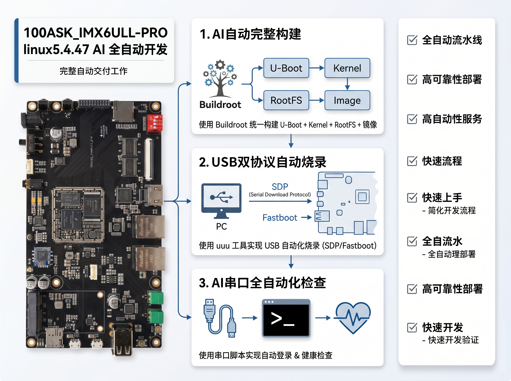

# 100ASK_IMX6ULL-PRO AI 全自动开发平台

欢迎使用 **100ASK_IMX6ULL-PRO** Linux 5.4.47 全自动开发平台。本平台基于 Buildroot 构建，为 i.MX6ULL Pro 开发板提供从源码编译、系统烧录到应用开发的全流程支持。



## 开发环境要求

- **操作系统**: Ubuntu 24.04
- **工具链**: arm-linux-gnueabihf- (gcc 9.2)
- **磁盘空间**: 至少 100GB
- **内存**: 至少 8GB

## 平台特性

- **Buildroot 统一构建** — 一键编译 U-Boot + Kernel + RootFS
- **USB 自动烧录** — 通过 NXP UUU 工具完成 eMMC 烧录
- **串口自动化** — 烧录后自动登录与健康检查
- **AI 驱动开发** — 提供 AI 技能模板，自动化编译/烧录/验证闭环

## 源码框架

```bash
┌──────────────────────────────────────────────────────────────────────┐
│                       aibsp-imx6ull-pro_linux5.4.47                 │
├──────────────────────────────────────────────────────────────────────┤
│ buildroot-2026.02.1                                                  │
│  ├─ configs/100ask_imx6ull-pro_defconfig                             │
│  ├─ package/ (含 lvgl9-demo 等包)                                    │
│  ├─ board/100ask/imx6ull-pro/                                        │
│  └─ output/images/  -> 产出 u-boot-dtb.imx, zImage, dtb, sdcard.img │
│                     │                                                 │
│                     ▼                                                 │
│ flash_usb_shell                                                      │
│  ├─ auto_flash_and_serial.sh      (方式1/通用自动化)                 │
│  ├─ add_pkg_flash_verify.sh       (加包->编译->刷写->串口验证)       │
│  ├─ way2_recovery_flash.sh        (方式2 Fastboot刷写入口)           │
│  ├─ *.uuu                         (uuu脚本)                          │
│  └─ serial_login_check.py         (调用 linux_serial_agent)          │
│                     │                                                 │
│                     ▼                                                 │
│ linux_serial_agent                                                    │
│  └─ trae_serial_terminal_go + pexpect 封装                           │
│                     │                                                 │
│                     ▼                                                 │
│ uuucli/build/uuu/uuu  <---- USB ---->  i.MX6ULL (SDP/Fastboot)      │
│                                                                      │
│ 子模块：                                                             │
│  uboot-imx (gitee)     linux-imx (gitee)                             │
└──────────────────────────────────────────────────────────────────────┘
```


## 核心目录差异与职责


```

aibsp-imx6ull-pro_linux5.4.47
├── buildroot-2026.02.1/          # Buildroot 系统集成
├── flash_usb_shell/              # 烧录与串口验证脚本
├── linux_serial_agent/           # 串口自动化代理
├── uuucli/build/uuu/             # NXP UUU 烧录工具
├── uboot-imx/                    # U-Boot 源码（子模块）
└── linux-imx/                    # Linux 内核源码（子模块）
```

###  `buildroot-2026.02.1`


- 角色：系统集成与产物总入口。
- 负责：工具链配置、RootFS 选包、Kernel/U-Boot 拉取与编译、镜像打包。
- 典型输入：`configs/100ask_imx6ull-pro_defconfig`。
- 典型输出：`output/images/u-boot-dtb.imx`、`sdcard.img`、`zImage`、`*.dtb`。

###  `linux-imx`（子模块）


- 角色：内核源码上游。
- 负责：驱动、设备树、内核配置能力。
- 与 Buildroot 关系：Buildroot 按 defconfig 中的 `CUSTOM_GIT` 配置从在线仓库获取（仓库中也保留子模块用于开发对比/补丁管理）。

###  `uboot-imx`（子模块）


- 角色：Bootloader 源码上游。
- 负责：上电初始化、启动内核、fastboot/bmode 等升级入口。
- 与 Buildroot 关系：同样由 Buildroot 的 `CUSTOM_GIT` 逻辑取源码构建。

###  `linux_serial_agent`


- 角色：串口自动化基础层。
- 负责：串口枚举、发命令、自动登录（含 `login:`/`Password:`/直进 shell 场景）。
- 典型调用方：`flash_usb_shell/serial_login_check.py`。

###  `uuucli`


- 角色：NXP UUU 工具源码与本地构建目录。
- 负责：USB SDP/Fastboot 传输烧录。
- 可执行文件：`uuucli/build/uuu/uuu`。

### 2.6 `flash_usb_shell`


- 角色：项目烧录与验证编排层（本仓库最常用入口）。
- 负责：自动进烧录模式、调用 uuu、刷后串口验证、批量流程脚本化。
- 说明：已替代旧目录 `tools/imx6ull_flash_serial_framework`。
