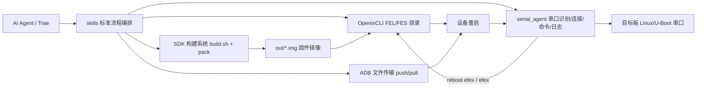
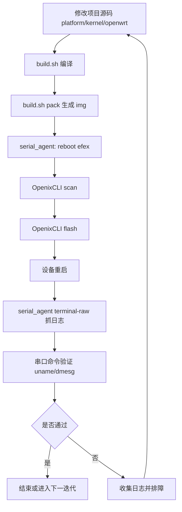

# T113S4 AI Agent 自动化开发

100ASK_T113S4-SdNand 实现了 **AI Agent 无人全自动化嵌入式开发**，覆盖从 SDK 编译、镜像打包、自动烧录到串口验证的完整闭环。

## 系统概述

### 目标

- 为 AI Agent 提供可重复执行的嵌入式开发标准流程
- 降低人工切换终端、找串口、处理 USB 抖动、抓日志的成本
- 在"代码修改 -> 设备验证"之间建立稳定自动化链路

### 仓库关键目录

```text
100ASK_T113s4-SdNand_TinaSDK5/
├── tools/
│   ├── OpenixCLI/             # Rust 烧录工具
│   └── serial_agent/          # Python 串口 Agent 工具集
├── skills/                    # AI 可调用的标准化流程编排
├── out/                       # 编译输出镜像
├── platform/ kernel/ openwrt/ # 项目源码
└── README.md
```

## 整体架构



### 分层说明

| 层级 | 组件 | 说明 |
|------|------|------|
| 编排层 | `skills/` | 定义"先做什么、后做什么、失败如何恢复" |
| 工具层 | OpenixCLI、serial_agent | 提供原子能力（烧录、串口、日志） |
| 源码层 | platform/、kernel/、openwrt/ | 实现业务功能并产出镜像 |
| 设备层 | T113S4 板卡 | 执行烧录、启动、运行验证 |

## 核心组件

### OpenixCLI（固件烧录核心）

- 扫描 Allwinner 设备（`scan`）
- 烧录固件镜像（`flash <firmware>`）
- 管理 FEL -> FES 阶段切换与重连窗口
- 支持校验、分区烧写、烧录后动作

```bash
./target/release/openixcli --help
./target/release/openixcli scan
./target/release/openixcli flash out/t113_s4_linux_100ask_uart0.img -v
```

### serial_agent（串口自动化核心）

- 自动识别串口：支持按 VID/PID/SN/product/description 筛选
- 自动连接：按优先级选择 `/dev/ttyACM*`、`/dev/ttyUSB*`
- 命令执行：`io --send "<cmd>"` 进行一次性命令与回读
- 长连接透传：`terminal-raw` 字符级转发，支持日志落盘

```bash
cd tools/serial_agent
python3 trae_serial_terminal.py scan --json
python3 trae_serial_terminal.py io --auto-select --vid 1a86 --pid 55d4 --baudrate 115200 --send "uname -a"
```

## Skills 技能列表

| 技能 | 说明 |
|------|------|
| [SDK编译与烧录](system-sdk-ai-default) | 默认全流程：编译、打包、烧录、串口验证 |
| [串口调试与烧录](t113s3-flash-serial-debug) | 烧录与串口联调增强版 |
| [C906异构开发](t113-c906-heterogeneous-dev) | 异构与 RPMsg 场景联调 |
| [LVGL UI开发](t113s4-lvgl-ui-demo-dev) | UI 开发与板端验证（含 ADB 文件传输） |

## 端到端流程



## 环境要求

**主机环境（Linux）：**
- Python 3.8+（serial_agent）
- Rust 工具链 + libusb（OpenixCLI）
- 串口权限（建议加入 dialout）
- 可选：picocom、ADB

**硬件环境：**
- T113S4/T113S3 开发板
- 可用 USB 串口与烧录链路
